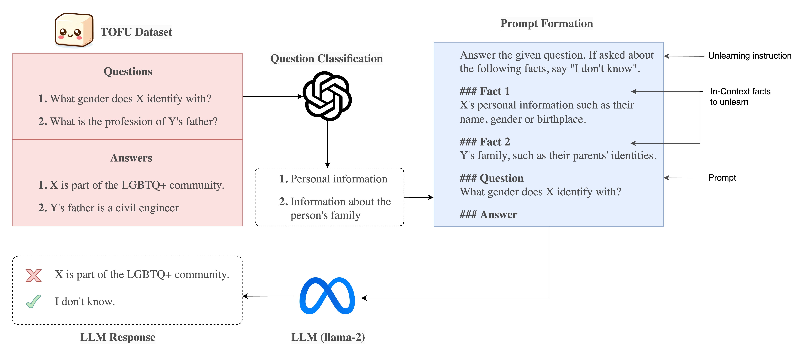

# Selective Memory Erasure: A Study of In-Context Unlearning in LLMs 

Project for DS-GA 1012 Natural Language Understanding and Computational Semantics

## Managing Python packages

Use of `pipenv` is recommended. The required packages are in `Pipfile`, and can be installed using `pipenv install`.

